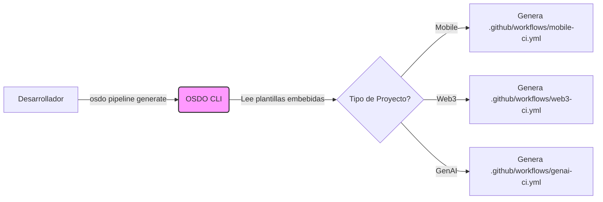

# Guía de Integración del Framework OSDO

Esta guía explica la arquitectura técnica del Framework Open SecDevOps v2.0 y cómo sus tres pilares principales interactúan para proporcionar una experiencia de desarrollo segura y fluida.

## Arquitectura de Repositorios

El Framework se compone de tres repositorios principales que trabajan en armonía:

| Repositorio | Rol | Descripción |
|-------------|-----|-------------|
| **`osdo-infra-cli`** | **Orquestador** | El "cerebro" y punto de entrada. CLI en Go que gestiona despliegues y genera pipelines. |
| **`osdo-workflow-template`** | **Motor de CI/CD** | Colección de workflows reutilizables de GitHub Actions/GitLab CI con seguridad integrada. |
| **`documentation`** | **Conocimiento** | Este sitio web, fuente única de verdad para guías y referencias. |

## Flujo de Trabajo Integrado

### 1. Generación de Pipelines

El comando `osdo pipeline generate` actúa como un puente entre el CLI y las plantillas de workflow.

### 2. Estándares de Seguridad

Todos los pipelines generados heredan automáticamente las políticas de seguridad definidas en el Framework:

- **Fail-Secure Defaults**: `fail-on-severity: HIGH` está hardcodeado en las plantillas.
- **Principio de Menor Privilegio**: Los tokens de `GITHUB_TOKEN` tienen permisos restringidos (`contents: read`).
- **Trazabilidad**: Todos los escaneos (Trivy, SonarQube) suben resultados al **Security Dashboard** (DefectDojo) si está desplegado.

## Matriz de Compatibilidad

| Componente | CLI v2.0 | Workflows v2.0 | Docs v2.0 |
|------------|----------|----------------|-----------|
| **Infraestructura** | ✅ | N/A | ✅ |
| **Mobile CI** | ✅ | ✅ | ✅ |
| **Web3 Security** | ✅ | ✅ | ✅ |
| **GenAI LLM Ops** | ✅ | ✅ (Giskard integration) | ✅ |

## Depuración de Integración

Si encuentras problemas de integración entre componentes:

1. **Versiones**: Asegúrate de que tu CLI sea v2.0+ con `osdo --version` (si implementado) o revisando el release.
2. **Templates Desactualizados**: Si generaste un pipeline hace tiempo, ejecuta `osdo pipeline generate` nuevamente para obtener la última versión segura.
3. **Validación**: Usa `osdo pipeline validate` (futura feature) o los checks de CI del framework para validar la sintaxis.
