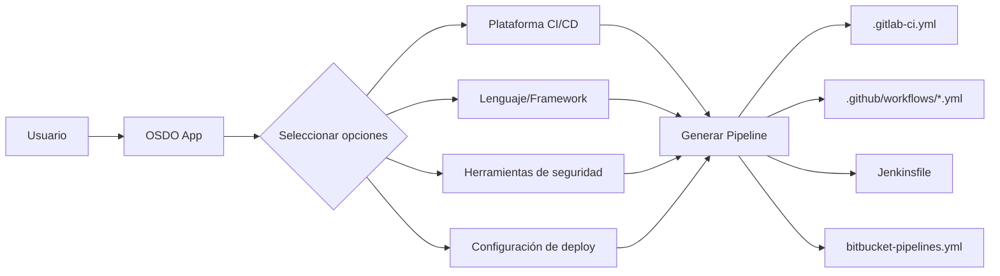
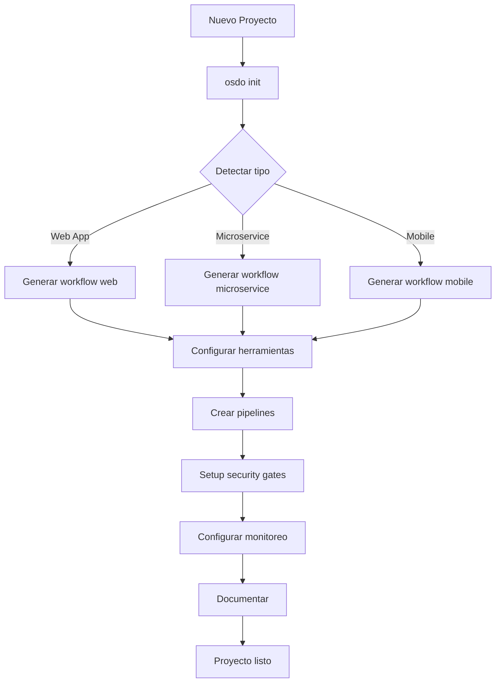
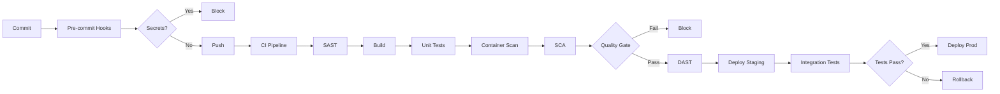
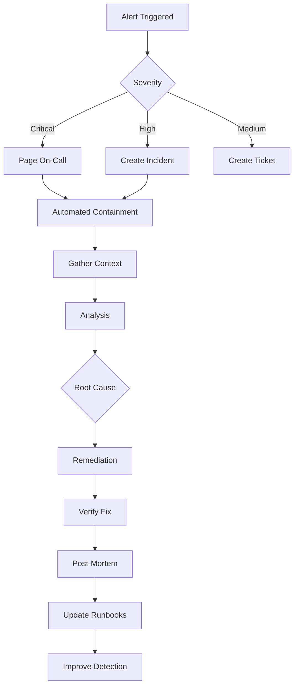

# OSDO como Marco de Trabajo

OSDO no es solo una colección de herramientas, es un **marco de trabajo integral** que proporciona estructura, guías y componentes pre-configurados para implementar DevSecOps de manera efectiva.

## Arquitectura del Framework

### Capas del Framework OSDO

```
┌─────────────────────────────────────────────────────────────┐
│                    Layer 5: Governance                      │
│  • Políticas de seguridad  • Compliance  • Métricas        │
├─────────────────────────────────────────────────────────────┤
│                    Layer 4: Automation                      │
│  • CI/CD  • GitOps  • Policy as Code  • Auto-remediation   │
├─────────────────────────────────────────────────────────────┤
│                    Layer 3: Security                        │
│  • SAST  • DAST  • SCA  • Secrets  • Runtime Security      │
├─────────────────────────────────────────────────────────────┤
│                    Layer 2: Observability                   │
│  • Metrics  • Logs  • Traces  • Alerts  • Dashboards       │
├─────────────────────────────────────────────────────────────┤
│                    Layer 1: Infrastructure                  │
│  • Kubernetes  • Containers  • Networking  • Storage        │
└─────────────────────────────────────────────────────────────┘
```

### Componentes Core del Framework

OSDO proporciona dos herramientas principales que trabajan en conjunto:

#### 1. OSDO CLI - Herramienta de Gestión de Infraestructura

El CLI es el componente responsable de **desplegar y gestionar la infraestructura** DevSecOps. **Construido con Node.js/TypeScript** usando el framework [Oclif](https://oclif.io), lo que garantiza máxima compatibilidad con OSDO App.

```bash
# Instalación
npm install -g @opensecdevops/osdo-cli

# O usar directamente con npx
npx @opensecdevops/osdo-cli --help

# Gestión de clusters Kind
osdo kind create dev-local
osdo kind list
osdo kind delete dev-local

# Gestión de componentes de infraestructura
osdo deploy --platform kind --components sonarqube,harbor
osdo deploy --platform kubernetes --preset development
osdo deploy --interactive --platform k3s
osdo status --platform kubernetes

# Ver plan de despliegue sin ejecutar
osdo deploy --platform kind --preset production --dry-run

# Operaciones avanzadas
osdo deploy --platform kubernetes \
  --components gitlab,harbor,sonarqube,defectdojo \
  --domain osdo.empresa.com \
  --namespace prod \
  --registry registry.empresa.com
```

**Ventajas del CLI:**
- ✅ **Node.js/TypeScript**: Mismo runtime que OSDO App para máxima compatibilidad
- ✅ **Oclif Framework**: CLI robusto y extensible (usado por Heroku, Salesforce)
- ✅ **Abstracción de complejidad**: Despliegues simplificados en cualquier plataforma
- ✅ **Consistencia**: Kubernetes, K3s, Kind, Docker Swarm, Docker Compose, Helm
- ✅ **Modo Interactivo**: Selección visual de componentes con inquirer
- ✅ **Presets inteligentes**: Configuraciones predefinidas (dev, staging, prod)
- ✅ **Dry-run mode**: Ver plan antes de ejecutar
- ✅ **Validación integrada**: Validación de componentes y dependencias

**Gestiona:**
- 🏗️ Infraestructura base (Kubernetes, networking, storage)
- 🔒 Herramientas de seguridad (SonarQube, DefectDojo, Harbor, Trivy, Falco, Kyverno)
- 📊 Observabilidad (Prometheus, Grafana, Jaeger)
- 🔐 Gestión de secretos (Vault)
- 📦 Registros de contenedores (Harbor, Nexus)
- 🚀 CI/CD (GitLab, Jenkins)

[Ver documentación completa del OSDO CLI →](../../infra-cli/README.md)

#### 2. OSDO App - Generador de Pipelines CI/CD

OSDO App es una **aplicación web interactiva** que permite crear pipelines de CI/CD personalizados mediante formularios dinámicos:

```bash
# Acceder a la aplicación web
https://app.opensecdevops.org

# O instalar el generador local
npm install -g yo @opensecdevops/generator-osdo
yo @opensecdevops/osdo
```

**Características principales:**
- **Generación visual de pipelines** mediante formularios
- **Múltiples plataformas CI/CD:** GitLab CI, GitHub Actions, Jenkins, Bitbucket
- **Soporte multi-lenguaje:** Node.js, Python, PHP/Laravel, Go, Java, .NET
- **Bloques modulares reutilizables:**
  - SAST (SonarQube, Semgrep)
  - DAST (OWASP ZAP)
  - SCA (Dependency Track)
  - Container Scanning (Trivy)
  - Secret Scanning (Gitleaks)
  - Vulnerability Management (DefectDojo)
  - Quality Gates
  - Deploy (Kubernetes, Docker)
- **Comunidad de paquetes:** Compartir y reutilizar configuraciones
- **Validación automática** de configuraciones
- **Sistema de paquetes:** Estructura modular y extensible

**Flujo de trabajo con OSDO App:**



**Ejemplo de uso:**

1. **Acceder a OSDO App**
   ```
   https://app.opensecdevops.org
   ```

2. **Configurar proyecto**
   - Plataforma CI/CD: GitLab CI
   - Lenguaje: Node.js (React)
   - Herramientas:
     - Gitleaks (Secret scanning)
     - SonarQube (SAST)
     - npm audit (SCA)
     - Trivy (Container scanning)
     - DefectDojo (Vulnerability management)
   - Deploy: Kubernetes con ArgoCD

3. **Generar y descargar**
   - Pipeline completo generado: `.gitlab-ci.yml`
   - Scripts auxiliares incluidos
   - Documentación integrada

4. **Integrar en proyecto**
   ```bash
   cp .gitlab-ci.yml mi-proyecto/
   git add .gitlab-ci.yml
   git commit -m "Add OSDO security pipeline"
   git push
   ```

**Estructura de paquetes OSDO App:**

Los paquetes son modulares y compartibles:

```
mi-paquete/
├── README.md                 # Documentación del paquete
├── config.json              # Configuración del formulario
└── templates/               # Plantillas Handlebars
    ├── main.hbs            # Template principal
    ├── sast.hbs            # Bloque SAST
    ├── container.hbs       # Bloque container scanning
    └── deploy.hbs          # Bloque deployment
```

**config.json - Define el formulario:**
```json
{
  "name": "Node.js Security Pipeline",
  "version": "1.0.0",
  "description": "Pipeline seguro para Node.js con SAST, SCA y container scanning",
  "type": "pipeline",
  "template": "main",
  "file": ".gitlab-ci.yml",
  "language": "yaml",
  "blocks": [
    {
      "template": "gitleaks",
      "name": "Secret Scanning",
      "description": "Detecta secretos en el código",
      "fields": [
        {
          "type": "text",
          "name": "job_name",
          "label": "Nombre del job",
          "default": "gitleaks",
          "rules": "required"
        },
        {
          "type": "switch",
          "name": "allow_failure",
          "label": "Permitir fallo",
          "default": false
        }
      ]
    }
  ]
}
```

**Crear paquetes personalizados:**
```bash
# Instalar generador
npm install -g yo @opensecdevops/generator-osdo

# Crear nuevo paquete
yo @opensecdevops/osdo

# Responder preguntas:
# - Nombre del paquete: my-custom-pipeline
# - Tipo: pipeline
# - Plataforma: GitLab CI
# - Bloques: SAST, Container Scanning

# Estructura generada automáticamente
```

**Testing de paquetes:**
```bash
npm install --save-dev @opensecdevops/jest-osdo

# test/config.test.js
test('validate config structure', () => {
    expect(config).toBeStructure();
});

test('render pipeline correctly', () => {
    const data = { gitleaks: { job_name: "gitleaks" } };
    expect(render).toBeRender(data);
});
```

[Ver documentación completa de OSDO App →](../../app/README.md)

#### 3. Cómo Trabajan Juntos OSDO CLI y OSDO App

Los dos componentes se complementan perfectamente:

```
┌─────────────────────────────────────────────────────────────┐
│                    Flujo Completo OSDO                      │
└─────────────────────────────────────────────────────────────┘

1. Infraestructura (OSDO CLI)
   ┌──────────────────────────────────────────┐
   │ osdo k3s create production               │
   │ osdo deploy --preset production          │
   │                                          │
   │ Desplegado:                              │
   │  ✓ GitLab                                │
   │  ✓ SonarQube                             │
   │  ✓ Harbor + Trivy                        │
   │  ✓ DefectDojo                            │
   │  ✓ Prometheus + Grafana                  │
   │  ✓ ArgoCD                                │
   └──────────────────────────────────────────┘
                    ↓
2. Pipeline personalizado (OSDO App)
   ┌──────────────────────────────────────────┐
   │ https://app.opensecdevops.org            │
   │                                          │
   │ Configurar formulario:                   │
   │  → GitLab CI                             │
   │  → Node.js + React                       │
   │  → SonarQube SAST                        │
   │  → Trivy Container Scan                  │
   │  → DefectDojo Integration                │
   │  → Deploy to Kubernetes                  │
   │                                          │
   │ Descargar: .gitlab-ci.yml                │
   └──────────────────────────────────────────┘
                    ↓
3. Ejecución automática
   ┌──────────────────────────────────────────┐
   │ git push → GitLab CI ejecuta             │
   │                                          │
   │ Pipeline:                                │
   │  1. Gitleaks → Busca secretos            │
   │  2. SonarQube → Análisis SAST            │
   │  3. Build → Construye imagen             │
   │  4. Trivy → Escanea contenedor           │
   │  5. DefectDojo → Centraliza resultados   │
   │  6. ArgoCD → Despliega a K8s             │
   │                                          │
   │ Métricas en Grafana automáticamente      │
   └──────────────────────────────────────────┘
```

**Ventajas de la integración:**
- **Sin configuración manual:** Los pipelines generados ya conocen las URLs de las herramientas
- **Consistencia:** Mismos estándares en toda la organización
- **Rápida adopción:** Minutos en lugar de semanas
- **Mantenibilidad:** Actualizar template actualiza todos los proyectos
- **Flexibilidad:** Cada proyecto puede customizar según necesidad

Plantillas pre-configuradas para diferentes escenarios:

**Template Básico:**
```yaml
# .osdo/workflow.yaml
version: "1.0"
type: web-application
language: node
framework: react

pipeline:
  stages:
    - prepare
    - security-scan
    - build
    - test
    - security-test
    - deploy

security:
  sast:
    enabled: true
    tool: sonarqube
    quality_gate: true
  
  secrets:
    enabled: true
    tool: gitleaks
    fail_on_detection: true
  
  sca:
    enabled: true
    tool: dependency-track
    cvss_threshold: 7.0
  
  container:
    enabled: true
    tool: trivy
    severity: HIGH,CRITICAL
  
  dast:
    enabled: true
    tool: owasp-zap
    scan_type: baseline

deployment:
  strategy: blue-green
  target: kubernetes
  namespace: production
  health_check: true
  rollback_on_failure: true
```

**Generación automática:**
```bash
# Detecta el proyecto y genera workflow apropiado
osdo init

# O especifica el tipo
osdo init --type microservice --language golang
osdo init --type mobile-app --platform ios
osdo init --type infrastructure --tool terraform
```

#### 3. Presets - Configuraciones Predefinidas

Conjuntos de componentes optimizados para diferentes escenarios:

##### Development Preset
```yaml
components:
  - gitlab (CI/CD)
  - harbor (Registry)
  - sonarqube (SAST)
  - defectdojo (Vulnerability Management)
  - prometheus (Metrics)
  - grafana (Dashboards)
  
resources:
  size: small
  replicas: 1
  persistence: enabled
  
networking:
  ingress: enabled
  tls: self-signed
```

##### Staging Preset
```yaml
components:
  - gitlab (CI/CD)
  - jenkins (Alternative CI)
  - harbor (Registry)
  - sonarqube (SAST)
  - owasp-zap (DAST)
  - dependency-track (SCA)
  - defectdojo (Vulnerability Management)
  - vault (Secrets)
  - prometheus (Metrics)
  - grafana (Dashboards)
  - loki (Logs)
  
resources:
  size: medium
  replicas: 2
  persistence: enabled
  
networking:
  ingress: enabled
  tls: letsencrypt
```

##### Production Preset
```yaml
components:
  # CI/CD
  - gitlab (High Availability)
  - jenkins (Distributed)
  - argocd (GitOps)
  
  # Security
  - harbor (HA + Replication)
  - sonarqube (HA)
  - owasp-zap (Scheduled)
  - dependency-track (HA)
  - defectdojo (HA)
  - vault (HA + Auto-unseal)
  - falco (Runtime Security)
  - kyverno (Policy Enforcement)
  
  # Observability
  - prometheus (HA)
  - alertmanager (Clustered)
  - grafana (HA)
  - loki (Distributed)
  - jaeger (Production)
  
  # Infrastructure
  - cert-manager (Production)
  - nginx-ingress (HA)
  - istio (Service Mesh)
  - velero (Backup)
  
resources:
  size: large
  replicas: 3+
  persistence: enabled
  backup: enabled
  
networking:
  ingress: enabled
  tls: letsencrypt
  service_mesh: enabled
  
compliance:
  policies: enforced
  audit_logging: enabled
  rbac: strict
```

**Uso:**
```bash
osdo deploy --preset development
osdo deploy --preset staging
osdo deploy --preset production --cluster prod-cluster-01
```

#### 4. Policy Library - Políticas Predefinidas

Colección de políticas Kyverno para diferentes casos de uso:

```bash
osdo-policies/
├── security/
│   ├── require-non-root.yaml
│   ├── require-readonly-rootfs.yaml
│   ├── disallow-privileged.yaml
│   ├── require-resource-limits.yaml
│   └── require-probe.yaml
├── compliance/
│   ├── pci-dss/
│   ├── hipaa/
│   └── gdpr/
├── best-practices/
│   ├── require-labels.yaml
│   ├── disallow-latest-tag.yaml
│   └── require-owner.yaml
└── custom/
    └── organization-specific/
```

**Aplicación:**
```bash
# Aplicar policies de seguridad
osdo policy apply --category security

# Aplicar compliance específico
osdo policy apply --compliance pci-dss

# Validar antes de aplicar
osdo policy validate --dry-run

# Ver políticas aplicadas
osdo policy list --cluster prod
```

## Flujos de Trabajo del Framework

### Flujo 1: Onboarding de Nuevo Proyecto



**Comandos:**
```bash
# 1. Inicializar proyecto
cd mi-nuevo-proyecto
osdo init --interactive

# 2. Review configuración
cat .osdo/workflow.yaml

# 3. Aplicar configuración
osdo apply

# 4. Verificar
osdo validate

# 5. Primer deploy
git add .
git commit -m "Initial OSDO setup"
git push
```

### Flujo 2: CI/CD Automatizado



**Automatización completa:**
```yaml
# Configuración automática
stages:
  pre-commit:
    - name: secret-scan
      tool: gitleaks
      blocking: true
    - name: lint
      tool: eslint
      blocking: false
      
  ci:
    - name: sast
      tool: sonarqube
      quality_gate: true
      timeout: 10m
      
    - name: build
      cache: true
      parallel: 4
      
    - name: test
      coverage_threshold: 80%
      
    - name: container-scan
      tool: trivy
      severity: HIGH,CRITICAL
      
    - name: sca
      tool: dependency-track
      cvss_threshold: 7.0
      
  security-test:
    - name: dast
      tool: owasp-zap
      environment: staging
      
  deploy:
    strategy: blue-green
    health_check:
      path: /health
      timeout: 60s
      initial_delay: 30s
    rollback:
      automatic: true
      on_failure: true
```

### Flujo 3: Incident Response



**Automatización:**
```yaml
# incident-response.yaml
incidents:
  critical_vulnerability_detected:
    trigger:
      - vulnerability_severity: critical
      - in_production: true
    
    automated_response:
      - isolate_affected_pods
      - scale_down_replicas
      - notify_security_team
      - create_incident_ticket
      - gather_forensics
    
    manual_steps:
      - assess_impact
      - develop_patch
      - test_patch
      - deploy_fix
      - verify_remediation
    
    post_incident:
      - update_documentation
      - improve_detection
      - share_learnings
```

## Integración con Ecosistemas

### Integración con GitLab

```yaml
# .gitlab-ci.yml generado por OSDO
include:
  - project: 'osdo/osdo-pipelines'
    ref: main
    file: '/templates/node-webapp.yml'

variables:
  OSDO_VERSION: "1.0.0"
  SECURITY_ENABLED: "true"
  COMPLIANCE_MODE: "pci-dss"

stages:
  - prepare
  - security-scan
  - build
  - test
  - security-test
  - deploy
  - monitor

osdo-security-scan:
  extends: .osdo-sast
  variables:
    SONAR_PROJECT_KEY: ${CI_PROJECT_PATH_SLUG}

osdo-container-scan:
  extends: .osdo-trivy
  variables:
    TRIVY_SEVERITY: HIGH,CRITICAL

osdo-deploy-staging:
  extends: .osdo-deploy
  environment:
    name: staging
    url: https://staging.example.com
```

### Integración con Jenkins

```groovy
// Jenkinsfile generado por OSDO
@Library('osdo-jenkins-library') _

pipeline {
    agent {
        kubernetes {
            yaml osdo.podTemplate()
        }
    }
    
    environment {
        OSDO_VERSION = '1.0.0'
        SECURITY_ENABLED = true
    }
    
    stages {
        stage('Security Scan') {
            steps {
                osdo.securityScan([
                    sast: true,
                    secrets: true,
                    qualityGate: true
                ])
            }
        }
        
        stage('Build & Test') {
            parallel {
                stage('Build') {
                    steps {
                        osdo.build()
                    }
                }
                stage('Unit Tests') {
                    steps {
                        osdo.test()
                    }
                }
            }
        }
        
        stage('Container Security') {
            steps {
                osdo.containerScan([
                    severity: ['HIGH', 'CRITICAL']
                ])
            }
        }
        
        stage('Deploy') {
            steps {
                osdo.deploy([
                    environment: 'staging',
                    strategy: 'blue-green'
                ])
            }
        }
    }
    
    post {
        always {
            osdo.publishResults()
        }
        failure {
            osdo.notifyFailure()
        }
    }
}
```

### Integración con GitHub Actions

```yaml
# .github/workflows/osdo.yml generado por OSDO
name: OSDO Security Pipeline

on:
  push:
    branches: [ main, develop ]
  pull_request:
    branches: [ main ]

jobs:
  osdo-security:
    runs-on: ubuntu-latest
    steps:
      - uses: actions/checkout@v3
      
      - name: OSDO Security Scan
        uses: osdo/security-action@v1
        with:
          sast: true
          secrets: true
          sca: true
          quality-gate: true
          
      - name: Build and Test
        uses: osdo/build-action@v1
        
      - name: Container Scan
        uses: osdo/container-scan-action@v1
        with:
          severity: HIGH,CRITICAL
          
      - name: Deploy
        if: github.ref == 'refs/heads/main'
        uses: osdo/deploy-action@v1
        with:
          environment: staging
          strategy: blue-green
```

## Métricas del Framework

OSDO proporciona métricas integradas:

```yaml
# Métricas automáticas
osdo_metrics:
  security:
    - vulnerabilities_detected
    - vulnerabilities_fixed
    - mean_time_to_detect
    - mean_time_to_remediate
    - security_score
    
  quality:
    - code_coverage
    - technical_debt
    - code_smells
    - duplications
    
  deployment:
    - deployment_frequency
    - lead_time
    - change_failure_rate
    - mean_time_to_recovery
    
  compliance:
    - policy_compliance_rate
    - audit_pass_rate
    - certificate_expiration
```

**Dashboard automático:**
```bash
# Ver métricas
osdo metrics show --period 30d

# Exportar reporte
osdo metrics export --format pdf \
    --output monthly-report.pdf

# Ver en Grafana
osdo dashboard open security-posture
```

## Casos de Uso Avanzados

### Multi-Cluster Management

```bash
# Gestionar múltiples clusters
osdo cluster add prod-us-east --context prod-us
osdo cluster add prod-eu-west --context prod-eu

# Deploy multi-región
osdo deploy --clusters prod-us-east,prod-eu-west \
    --strategy multi-region \
    --sync-mode active-active

```

## Recursos del Framework

### Documentación
- [Arquitectura detallada](./arquitectura.md)
- [Guía de componentes](../infrastructura/README.md)

### Comunidad
- [GitHub Discussions](https://github.com/osdo/discussions)
- [Slack Community](https://osdo.slack.com)
- [Stack Overflow Tag](https://stackoverflow.com/questions/tagged/osdo)

### Training
- [OSDO Fundamentals](./training/fundamentals.md)
- [Advanced OSDO](./training/advanced.md)
- [OSDO Certification](./training/certification.md)

---

**¿Quieres contribuir al framework?**  
Lee nuestra [Guía de Contribución](./contributing.md) y únete a la comunidad en [GitHub](https://github.com/osdo).
